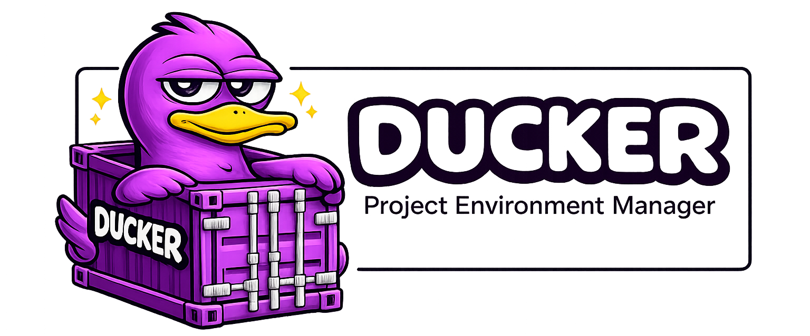
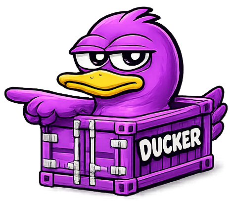
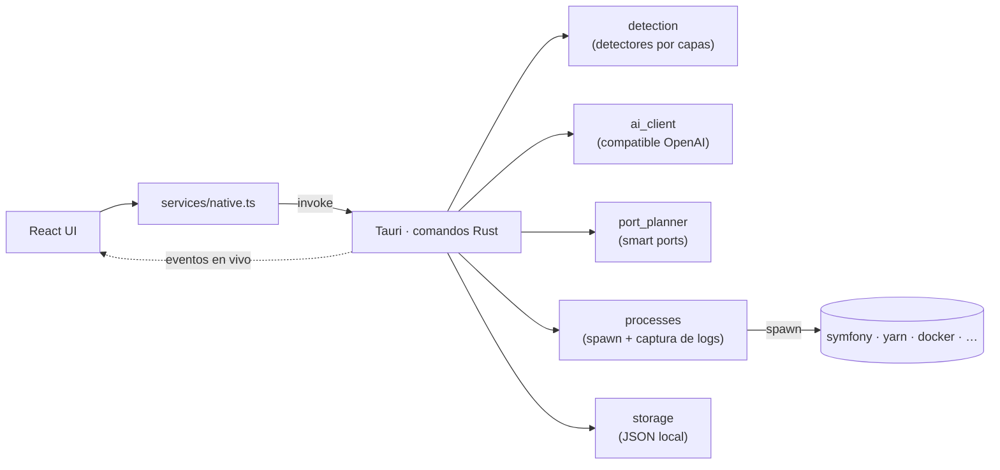
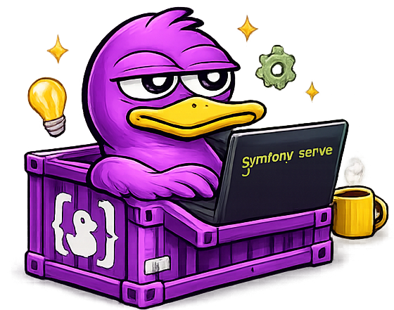

<div align="center">



### Apúntalo a cualquier proyecto. Detecta el stack, resuelve los puertos y te pone a trabajar en segundos.

**Ducker** es una app de escritorio local y rápida que detecta qué *es* un proyecto — Symfony, Next.js, Django, Go, Docker Compose, lo que sea — y convierte "clonar, configurar, abrir cinco terminales" en un solo clic.

[](https://tauri.app/)
[](https://react.dev/)
[](https://www.typescriptlang.org/)
[](https://www.rust-lang.org/)
[](LICENSE)
[](#primeros-pasos)

[English](README.md) · **Español**

</div>

<!--
Consejo: añade aquí una captura del dashboard para máximo impacto, p. ej.:

-->

---

## ¿Por qué Ducker?



Si saltas entre muchos proyectos, el coste real no es escribir código: es **reconstruir el contexto** cada vez:

> abrir la carpeta, arrancar el backend con sus flags, levantar el frontend, recordar los puertos, levantar la base de datos, abrir el editor, abrir las URLs, revisar los logs... y pararlo todo después.

Ducker reduce ese ritual a un solo panel. Añade un proyecto una vez y, a partir de ahí, un clic en **Work Mode** levanta todo el stack — editor abierto, cada servicio en un puerto sin conflictos, URLs en el navegador y logs en directo.

**No** está atado a un framework: un detector por capas reconoce los stacks comunes al instante, y un asesor de IA opcional se encarga del resto.

## Funcionalidades

- **Detección universal de stack** — detectores locales para Symfony, Laravel, Django, Flask, Rails, Go, Rust, .NET, Docker Compose y frontends JS (Vite, Next.js, Nuxt, Angular, CRA, Vue), eligiendo el gestor de paquetes (npm/yarn/pnpm/bun) y el script de desarrollo automáticamente.
- **IA primero** — cuando hay una API key configurada, un modelo compatible con OpenAI infiere los servicios, comandos y puertos, prefiriendo el comando nativo de cada framework. La detección determinista es el fallback automático.
- **Smart ports** — cada servicio recibe un puerto libre de forma determinista; si el preferido está ocupado, Ducker lo reasigna y reescribe el comando de forma segura (o te avisa claramente cuando no puede).
- **Work Mode** — un clic abre el editor, arranca todos los servicios y abre las URLs configuradas.
- **Logs y estado en vivo** — streaming de logs en tiempo real con colores y estado por servicio (en reposo, arrancando, activo, completado, fallido, parado), sin polling.
- **Paleta de comandos** — `Ctrl`/`Cmd`+`K` para saltar a cualquier proyecto o lanzar Work Mode sin tocar el ratón.
- **IA respetuosa con la privacidad** — solo se envían manifiestos y un árbol de archivos por nombre; **nunca tu código fuente**. La API key se guarda localmente.
- **Seguro por diseño** — los comandos se modelan como `ejecutable + args[] + directorio` (nunca cadenas de shell), con confirmación explícita para los comandos que marques como riesgosos.
- **App de escritorio nativa** — un único binario ligero e instalador, no otra pestaña de Electron.

## Cómo funciona

La interfaz nunca ejecuta comandos de shell directamente. Todo cruza una frontera tipada hacia Rust, que habla con el sistema y devuelve los resultados como eventos.



Un proyecto es una **lista de servicios**, cada uno con su comando, estrategia de puerto, entorno y URL — así Ducker puede modelar desde una web estática hasta un monorepo multiservicio.

## Primeros pasos

### Requisitos

- [Node.js](https://nodejs.org/) y npm
- [Rust y Cargo](https://www.rust-lang.org/tools/install)
- [Dependencias de sistema de Tauri](https://tauri.app/start/prerequisites/) para tu SO
- Los toolchains de los proyectos que quieras gestionar (p. ej. Symfony CLI, Composer, Yarn, Docker, tu editor)

### Ejecutar

```bash
npm install
npm run tauri:dev      # abre la app con recarga en caliente
```

### Generar un distribuible

```bash
npm run tauri:build    # genera el ejecutable nativo + instaladores
```

En Windows esto produce `ducker.exe` más instaladores MSI y NSIS en `src-tauri/target/release/`.

### Otros scripts

```bash
npm run typecheck      # TypeScript, sin emitir
npm run build          # solo build de producción del frontend
```

## Configuración

Abre **Settings** dentro de la app para configurar:

- **Comando del editor** que usa Work Mode (por defecto: `code`)
- **Comportamiento de Work Mode** — qué URLs abrir al arrancar
- **Confirmación de comandos riesgosos**
- **Asesor de IA** — actívalo y define base URL compatible con OpenAI, modelo y API key

> **Privacidad:** el asesor de IA solo recibe manifiestos (p. ej. `package.json`, `composer.json`), los scripts detectados y un árbol de archivos por nombre. El código fuente y los ficheros que parezcan secretos (`.env`, `*.pem`, tokens...) nunca se envían. Puedes revisar el snapshot exacto antes de que nada salga de tu máquina.

## Stack técnico

| Capa | Tecnología |
|------|------------|
| Shell | [Tauri 2](https://tauri.app/) (Rust) |
| Frontend | [React 19](https://react.dev/) · [TypeScript](https://www.typescriptlang.org/) · [Vite](https://vitejs.dev/) |
| Backend / nativo | [Rust](https://www.rust-lang.org/) |

## Roadmap

- [x] Modelo de proyecto como lista de servicios
- [x] Detección local por capas con opción de IA primero
- [x] Streaming de logs/estado en vivo
- [x] Smart ports con comprobación de readiness
- [x] Paleta de comandos y rediseño visual completo
- [ ] Dependencias y orden de arranque entre servicios (p. ej. base de datos antes que backend)
- [ ] Auto-stop de servicios al cerrar la app
- [ ] Firma de código para los instaladores
- [ ] Más adaptadores de smart ports (Django, Laravel, Rails, .NET...)
- [ ] Tests automatizados y CI

## Contribuir

Ducker está en desarrollo activo y las contribuciones son muy bienvenidas. Issues útiles:

- Tu SO y cómo levantas tus proyectos
- Stacks o patrones de comando que no se detecten bien
- Ideas de UX para el dashboard

## Licencia

[MIT](LICENSE) © dasge97

<div align="center">
<br/>

<br/>
<sub>Hecho con Tauri, React y Rust.</sub>
</div>
