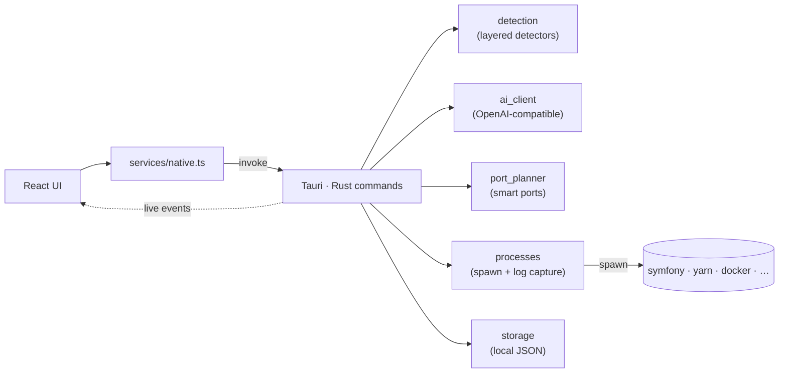

<div align="center">


### Point it at any project. It figures out the stack, wires up the ports, and gets you working in seconds.

**Ducker** is a fast, local desktop app that detects what a project *is* — Symfony, Next.js, Django, Go, Docker Compose, anything — and turns "clone, configure, run five terminals" into a single click.

[](https://tauri.app/)
[](https://react.dev/)
[](https://www.typescriptlang.org/)
[](https://www.rust-lang.org/)
[](LICENSE)
[](#getting-started)

**English** · [Español](README.es.md)

</div>

<!--
Tip: add a screenshot of the dashboard here for extra impact, e.g.:

-->

---

## Why Ducker?


If you jump between many projects, the real cost isn't writing code — it's **rebuilding the context** every time:

> open the folder, start the backend with the right flags, boot the frontend, remember which ports, spin up the database, open the editor, open the URLs, tail the logs... and tear it all down afterwards.

Ducker collapses that ritual into one panel. Add a project once, and from then on a single **Work Mode** click brings the whole stack to life — editor open, every service running on a conflict-free port, URLs in your browser, logs streaming live.

It is **not** tied to one framework. A layered detector recognises common stacks instantly, and an optional AI advisor handles everything else.

## Features

- **Universal stack detection** — local detectors for Symfony, Laravel, Django, Flask, Rails, Go, Rust, .NET, Docker Compose, and JS frontends (Vite, Next.js, Nuxt, Angular, CRA, Vue), choosing the right package manager (npm/yarn/pnpm/bun) and dev script automatically.
- **AI-first detection** — when an API key is configured, an OpenAI-compatible model infers the services, commands and ports, preferring each framework's native run command. Deterministic detection is the automatic fallback.
- **Smart ports** — every service gets a free port deterministically; if the preferred port is taken, Ducker reassigns it and rewrites the command safely (or tells you clearly when it can't).
- **Work Mode** — one click opens your editor, starts every service, and opens the configured URLs.
- **Live logs and status** — real-time, colour-coded log streaming and per-service status (idle, starting, running, completed, failed, stopped), no polling.
- **Command palette** — `Ctrl`/`Cmd`+`K` to jump to any project or launch Work Mode without leaving the keyboard.
- **Privacy-first AI** — only manifests and a names-only file tree are ever sent; **never your source code**. The API key is stored locally.
- **Safe by design** — commands are modelled as `executable + args[] + workingDirectory` (never shell strings), with explicit confirmation for commands you mark as risky.
- **Native desktop app** — a single lightweight binary and installer, not another Electron tab.

## How it works

The UI never runs shell commands directly. Everything crosses a typed boundary into Rust, which talks to your system and streams results back as events.



A project is a **list of services**, each with its own command, port strategy, environment and URL — so Ducker can model anything from a single static site to a multi-service monorepo.

## Getting started

### Prerequisites

- [Node.js](https://nodejs.org/) and npm
- [Rust and Cargo](https://www.rust-lang.org/tools/install)
- [Tauri system dependencies](https://tauri.app/start/prerequisites/) for your OS
- The toolchains of the projects you want to manage (e.g. Symfony CLI, Composer, Yarn, Docker, your editor)

### Run it

```bash
npm install
npm run tauri:dev      # launch the app with hot reload
```

### Build a distributable

```bash
npm run tauri:build    # produces a native executable + installers
```

On Windows this generates `ducker.exe` plus MSI and NSIS installers under `src-tauri/target/release/`.

### Other scripts

```bash
npm run typecheck      # TypeScript, no emit
npm run build          # frontend production build only
```

## Configuration

Open **Settings** inside the app to configure:

- **Editor command** used by Work Mode (default: `code`)
- **Work Mode** behaviour — which URLs to open on launch
- **Risky-command confirmation**
- **AI advisor** — enable it, set an OpenAI-compatible base URL, model and API key

> **Privacy:** the AI advisor only ever receives manifests (e.g. `package.json`, `composer.json`), detected scripts and a names-only file tree. Source code and secret-looking files (`.env`, `*.pem`, tokens...) are never sent. You can review the exact snapshot before anything leaves your machine.

## Tech stack

| Layer | Tech |
|------|------|
| Shell | [Tauri 2](https://tauri.app/) (Rust) |
| Frontend | [React 19](https://react.dev/) · [TypeScript](https://www.typescriptlang.org/) · [Vite](https://vitejs.dev/) |
| Backend / native | [Rust](https://www.rust-lang.org/) |

## Roadmap

- [x] Services-list project model
- [x] Layered local stack detection with AI-first option
- [x] Live log/status streaming
- [x] Smart ports with readiness checks
- [x] Command palette and full visual redesign
- [ ] Service dependencies and start order (e.g. database before backend)
- [ ] Auto-stop services on app close
- [ ] Code signing for installers
- [ ] More smart-port adapters (Django, Laravel, Rails, .NET...)
- [ ] Automated tests and CI

## Contributing

Ducker is in active development and contributions are very welcome. Helpful issues include:

- Your OS and how you launch your projects
- Stacks or command patterns that aren't detected well
- UX ideas for the dashboard

## License

[MIT](LICENSE) © dasge97

<div align="center">
<br/>

<br/>
<sub>Built with Tauri, React and Rust.</sub>
</div>
