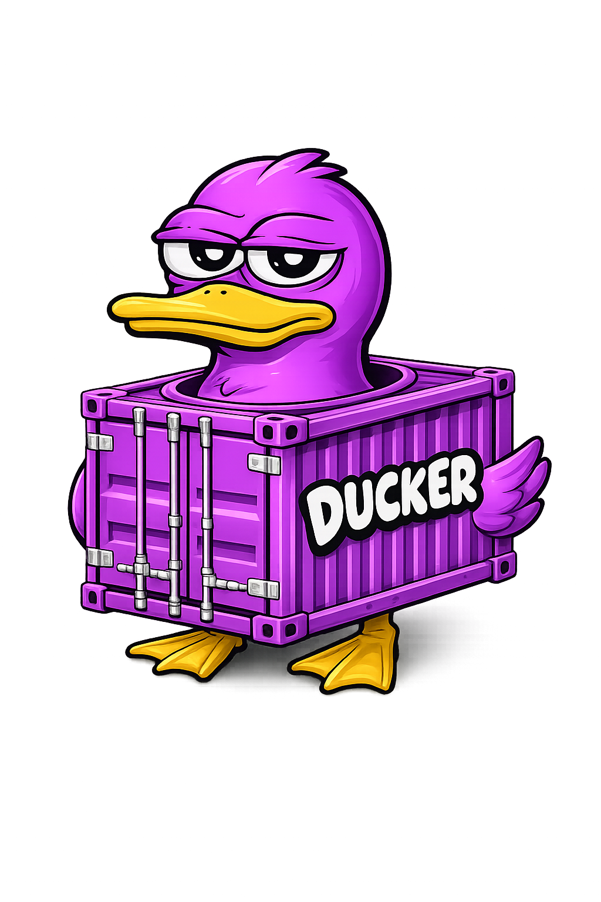

# Ducker

<p align="center">
  
</p>

**Ducker** es una aplicación local de escritorio para gestionar proyectos Symfony/Yarn desde una interfaz visual.

Está pensada para equipos y desarrolladores que saltan constantemente entre muchos proyectos similares: abrir carpeta, levantar backend, levantar frontend, abrir VS Code, abrir URLs, revisar logs… Ducker centraliza ese flujo para que arrancar un proyecto sea cuestión de segundos.

> Estado: MVP funcional en desarrollo. Ya existe la base de escritorio y las piezas principales, pero todavía necesita validación real en entornos Windows/Symfony/Yarn antes de considerarse estable.

## Qué problema resuelve

Cuando trabajas con muchos proyectos Symfony, el coste no está solo en programar: también está en preparar el contexto.

Cada cambio suele implicar:

- localizar la carpeta correcta;
- abrir el editor;
- arrancar `symfony server:start` con sus argumentos;
- levantar el frontend con Yarn;
- recordar puertos y URLs;
- parar procesos;
- revisar errores/logs.

Ducker busca convertir todo eso en un dashboard local: proyectos, estado y acciones rápidas.

## Funcionalidades del MVP

- CRUD de proyectos locales.
- Persistencia local en app-data mediante JSON.
- Detección de proyectos Symfony:
  - `composer.json`;
  - `bin/console`.
- Detección de frontend Yarn:
  - `package.json`;
  - `yarn.lock`.
- Sugerencia de comandos editables.
- Modelo seguro de comandos:

  ```txt
  executable + args[] + workingDirectory
  ```

- Arranque/parada de backend y frontend.
- Logs recientes y estado de comandos.
- Acciones rápidas:
  - abrir VS Code;
  - abrir carpeta;
  - abrir URL backend/frontend.
- Work Mode:
  - abrir editor;
  - arrancar backend/frontend;
  - abrir URLs configuradas.
- Settings básicos.
- Confirmaciones para acciones destructivas o comandos marcados como arriesgados.
- AI advisor (OpenAI-compatible):
  - configuración de provider/baseUrl/model;
  - API key guardada localmente en modo pragmático v2 (enmascarada en UI, no se devuelve en claro);
  - snapshot con privacidad por defecto (sin código fuente completo ni ficheros sensibles).
- Smart ports:
  - planificación determinista antes de arrancar;
  - reserva/liberación de puertos gestionados por Ducker;
  - adaptación automática para patrones conocidos (Symfony `--port`, dev servers frontend);
  - aviso explícito cuando no es seguro adaptar un comando.

## Stack

- [Tauri](https://tauri.app/) v2
- React
- TypeScript
- Vite
- Rust

## Arquitectura resumida

La interfaz no ejecuta comandos de shell directamente.

```txt
React UI
  → src/services/native.ts
  → comandos Tauri/Rust nombrados
  → sistema local: carpetas, Symfony CLI, Yarn, VS Code, navegador
```

Esta decisión es importante: evita partir strings de shell de forma insegura y protege casos típicos de Windows, como rutas con espacios.

## Desarrollo local

### Requisitos

- Node.js y npm.
- Rust/Cargo.
- Dependencias nativas de Tauri para tu sistema operativo.
- Para probar flujos reales:
  - Symfony CLI;
  - Composer;
  - Yarn;
  - VS Code o editor compatible.

### Comandos

```bash
npm install
npm run typecheck
npm run build
npm run tauri:dev
```

### Nota para Linux

Tauri necesita dependencias de sistema como GTK/WebKit/GLib/GIO. Si faltan, `cargo check` o `npm run tauri:dev` pueden fallar aunque TypeScript compile correctamente.

En el entorno actual de desarrollo se ha verificado:

- `npm run typecheck` ✅
- `npm run build` ✅

La verificación Rust/Tauri en Linux está pendiente de instalar dependencias nativas del sistema.

## Estado actual

El MVP está implementado estructuralmente, pero aún faltan validaciones importantes antes de llamarlo estable:

- prueba real en Windows;
- prueba real con un proyecto Symfony/Yarn;
- tests automatizados;
- empaquetado/installer;
- pulido visual.

## Roadmap cercano

- Validar `tauri dev` en Windows.
- Probar con proyectos Symfony reales.
- Añadir tests para detección, persistencia y comandos.
- Mejorar gestión de procesos en Windows.
- Añadir instalador.
- Mejorar UX/UI del dashboard.

## Contribuir

El proyecto está en fase temprana. Si te interesa usarlo o mejorarlo, puedes abrir issues con:

- tu sistema operativo;
- cómo levantas tus proyectos Symfony;
- errores o casos raros de comandos;
- ideas de UX para el dashboard.

## Licencia

MIT. Consulta `LICENSE`.
